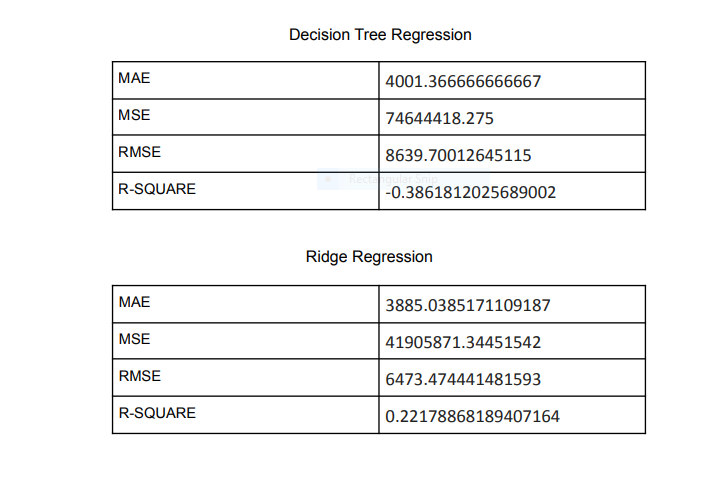
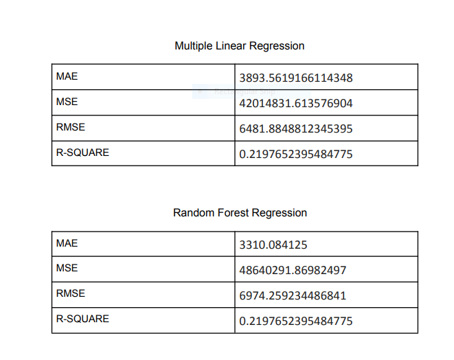
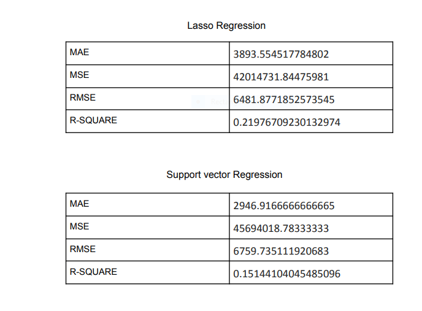

# Description:
Hotel room prices of different places increase every year, so there is a
need for a system to predict the prices in the future. This prediction can
help the owner determine the booking price of a hotel room and can help
the customer to book a room.
To predict rent (per day) I use regression models. 
# dataset:
In the dataset , 300 data from different websites of Bangladeshi Hotels were taken. Rent(Per Day) was predicted in BDT based
on the other features.
# Models:
* Decision Tree Regression 
* Ridge Regression 
* Multiple Linear Regression 
* Random Forest Regression 
* Lasso Regression 
* Support vector Regression

# Comparison of models

